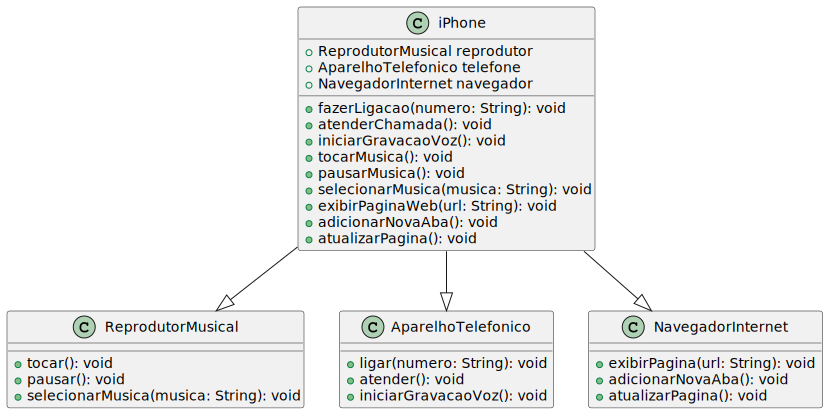

# POO - Desafio: Diagrama de classes do Iphone

Modelagem e diagramação da representação em UML e Código no que se refere ao componente iPhone

O diagrama foi feito no PlantUML e o código em Java.

## Diagrama de Classes


## Código
```java
public class iPhone {
    private ReprodutorMusical reprodutor;
    private AparelhoTelefonico telefone;
    private NavegadorInternet navegador;

    public iPhone() {
        reprodutor = new ReprodutorMusical();
        telefone = new AparelhoTelefonico();
        navegador = new NavegadorInternet();
    }

    public void fazerLigacao(String numero) {
        telefone.ligar(numero);
    }

    public void atenderChamada() {
        telefone.atender();
    }

    public void iniciarGravacaoVoz() {
        telefone.iniciarGravacaoVoz();
    }

    public void tocarMusica() {
        reprodutor.tocar();
    }

    public void pausarMusica() {
        reprodutor.pausar();
    }

    public void selecionarMusica(String musica) {
        reprodutor.selecionarMusica(musica);
    }

    public void exibirPaginaWeb(String url) {
        navegador.exibirPagina(url);
    }

    public void adicionarNovaAba() {
        navegador.adicionarNovaAba();
    }

    public void atualizarPagina() {
        navegador.atualizarPagina();
    }
}

class ReprodutorMusical {
    public void tocar() {
        System.out.println("Reprodutor de música: Tocando música...");
    }

    public void pausar() {
        System.out.println("Reprodutor de música: Pausando música...");
    }

    public void selecionarMusica(String musica) {
        System.out.println("Reprodutor de música: Selecionando música: " + musica);
    }
}

class AparelhoTelefonico {
    public void ligar(String numero) {
        System.out.println("Aparelho telefônico: Discando número " + numero);
    }

    public void atender() {
        System.out.println("Aparelho telefônico: Chamada atendida");
    }

    public void iniciarGravacaoVoz() {
        System.out.println("Aparelho telefônico: Iniciando gravação de voz...");
    }
}

class NavegadorInternet {
    public void exibirPagina(String url) {
        System.out.println("Navegador na Internet: Exibindo página: " + url);
    }

    public void adicionarNovaAba() {
        System.out.println("Navegador na Internet: Adicionando nova aba...");
    }

    public void atualizarPagina() {
        System.out.println("Navegador na Internet: Atualizando página...");
    }
}

public class Main {
    public static void main(String[] args) {
        iPhone myiPhone = new iPhone();
        
        myiPhone.fazerLigacao("123-456-7890");
        myiPhone.tocarMusica();
        myiPhone.selecionarMusica("Song A");
        myiPhone.exibirPaginaWeb("https://www.example.com");
    }
}
``````